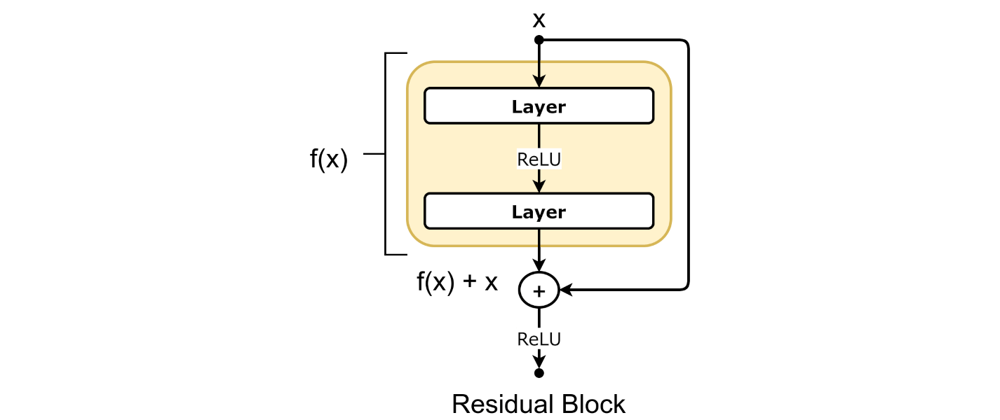

# Residual Block in Deep Learning

## Detailed Explanation of Residual Block

Residual blocks are an essential component of modern deep learning models, particularly in architectures like ResNet (Residual Networks). They help to train very deep networks by addressing the problem of vanishing gradients. A residual block allows the network to learn an identity function more easily, ensuring that information can flow through the network without degradation.

### How Residual Block Works

1. **Input and Output:** In a residual block, the input is directly added to the output of a few layers. This direct connection is called a "shortcut" or "skip connection."

2. **Main Path (F(x)):** The input goes through several layers (usually convolutional layers), which we call the main path. These layers might include convolutions, batch normalization, and activation functions like ReLU.
   

     
   

3. **Adding the Shortcut:** The input is added directly to the output of the main path. This is the key idea of a residual block.
   

     
   

### Why Use Residual Blocks?

- **Easier to Train:** The shortcut connection helps gradients to flow through the network, making it easier to train very deep networks.
- **Prevents Vanishing Gradients:** By allowing gradients to bypass some layers, it helps in mitigating the vanishing gradient problem.
- **Identity Learning:** If the additional layers are not useful, the network can easily learn to pass the input directly to the output, effectively learning an identity function.

### Uses

- **Image Recognition:** Commonly used in deep convolutional networks like ResNet.
- **Other Deep Learning Tasks:** Any task that benefits from deep architectures, including object detection and segmentation.

## Types of Residual Blocks

### 1. Basic Residual Block

A simple residual block usually consists of two convolutional layers:

  

### 2. Bottleneck Residual Block

A bottleneck residual block uses three convolutional layers to make the network more efficient by reducing and then restoring the number of channels. This helps to decrease the number of parameters and computational cost while maintaining performance.

#### Structure Diagram

Below is a simplified diagram of a bottleneck residual block:

#### Mathematical Representation

1. **Reduce Dimensions with 1x1 Convolution:**
   

     
   

2. **Process Features with 3x3 Convolution:**
   

     
   

3. **Restore Dimensions with 1x1 Convolution:**
   

     
   

4. **Add Input (Shortcut Connection):**
   

     
   

5. **Final Activation:**
   

     
   

## Comparison of Basic and Bottleneck Residual Blocks

| **Feature**                | **Basic Residual Block**                                                                                                        | **Bottleneck Residual Block**                                                                                                                                                      |
|----------------------------|--------------------------------------------------------------------------------------------------------------------------------|------------------------------------------------------------------------------------------------------------------------------------------------------------------------------------|
| **Structure**              | Two convolutional layers with a shortcut connection                                                                             | Three convolutional layers with 1x1 convolutions for reducing and restoring dimensions                                                                                             |
| **Formula**                |  |  |
| **Advantages**             | Simpler, fewer parameters                                                                                                       | More efficient, reduces number of parameters while maintaining performance                                                                                                          |
| **Use Cases**              | Shallower networks or initial layers                                                                                            | Deeper networks, especially in later stages where the number of parameters can be reduced without sacrificing performance                                                           |

### Example of a Residual Block Operation

Consider an input  passing through a basic residual block:

1. **Main Path (F(x)):** 
   

     
   

2. **Adding Input:** 
   

     
   

3. **Output:** The final output is the result of the addition, passed through an optional activation function.

### Summary

Residual blocks are a key innovation in deep learning that make training very deep networks feasible by mitigating the vanishing gradient problem. They achieve this by providing shortcut connections that allow gradients to bypass some layers, facilitating efficient and effective training.
