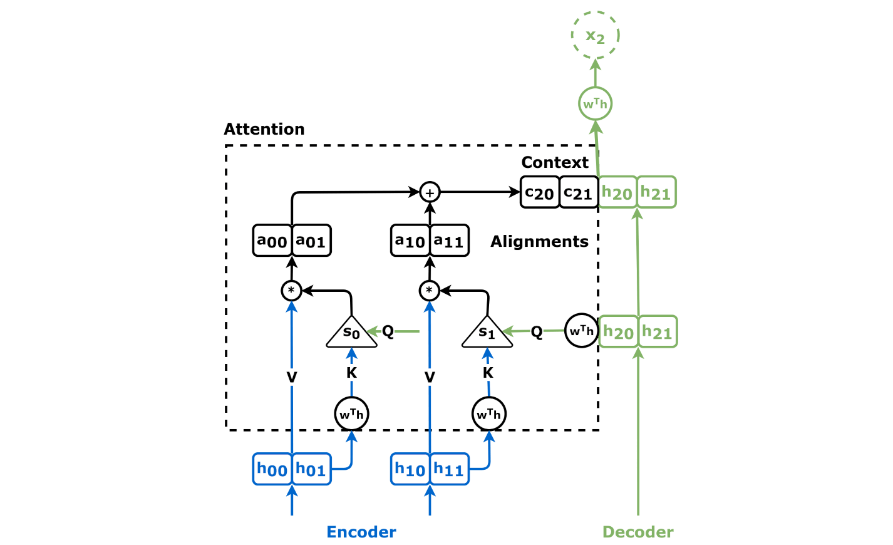

# Self-Attention Mechanism in Deep Learning

## Detailed Explanation of Self-Attention Mechanism

Self-attention is a mechanism used in neural networks, particularly in transformers, to enable the model to weigh the importance of different elements of the input sequence. It allows each element to focus on other elements, regardless of their distance in the sequence, making it highly effective for tasks involving sequential data like natural language processing.

### How Self-Attention Works

1. **Input Representation:** The input is a sequence of vectors, typically word embeddings in NLP tasks. Let's denote the input sequence as , where  is the embedding of the -th word.

2. **Linear Transformations:** Each input vector  is linearly transformed into three vectors: Query (), Key (), and Value ().
   

     
   

   Here,  are weight matrices.

3. **Attention Scores:** Compute the attention scores for each pair of Query and Key vectors using a dot product, followed by a scaling factor.
   

     
   

   Here,  is the dimensionality of the Key vectors.

4. **Softmax Normalization:** Apply the softmax function to obtain the attention weights, which sum to 1.
   

     
   

5. **Weighted Sum of Values:** Compute the weighted sum of the Value vectors, using the attention weights.
   

     
   

6. **Output:** The output of the self-attention layer is a new set of vectors , which are then fed into subsequent layers of the model.

### Properties and Advantages

- **Long-Range Dependencies:** Can capture relationships between words irrespective of their distance in the sequence.
- **Parallelizable:** Unlike RNNs, self-attention can be computed for all words in a sequence simultaneously, allowing for efficient parallel computation.
- **Dynamic Weighting:** The attention mechanism dynamically weighs the importance of different words, leading to better context understanding.

### Uses

- **Natural Language Processing (NLP):** Widely used in transformers for tasks like language translation, text summarization, and question answering.
- **Computer Vision:** Adapted in vision transformers (ViT) for image classification and other vision tasks.

### Comparison with Other Mechanisms

| **Mechanism**       | **Description**                                                                                 | **Advantages**                                                                                | **Disadvantages**                                             |
|---------------------|-------------------------------------------------------------------------------------------------|-----------------------------------------------------------------------------------------------|---------------------------------------------------------------|
| **Self-Attention**  | Weighs the importance of different elements in a sequence                                        | Captures long-range dependencies, parallelizable                                              | Computationally intensive for long sequences                   |
| **Recurrent Neural Networks (RNNs)** | Processes sequence data step-by-step, maintaining hidden states                                          | Handles sequences of varying length, captures temporal dependencies                           | Difficult to parallelize, suffers from vanishing gradient problem |
| **Convolutional Neural Networks (CNNs)** | Applies convolutional filters to extract local patterns                                                | Efficient for local pattern recognition                                                        | Limited receptive field, struggles with long-range dependencies  |

### Example of Self-Attention Calculation

Consider an input sequence with three words, represented by their embeddings .

1. **Linear Transformations:**
   

     
   

2. **Attention Scores:**
   

     
   

3. **Softmax Normalization:**
   

     
   

4. **Weighted Sum of Values:**
   

     
   

### Structure Diagram

Below is a diagram that illustrates the self-attention mechanism:

### Summary

Self-attention mechanisms are a powerful tool in deep learning, enabling models to dynamically focus on different parts of the input sequence, capturing long-range dependencies and improving performance in various tasks, especially in natural language processing.
